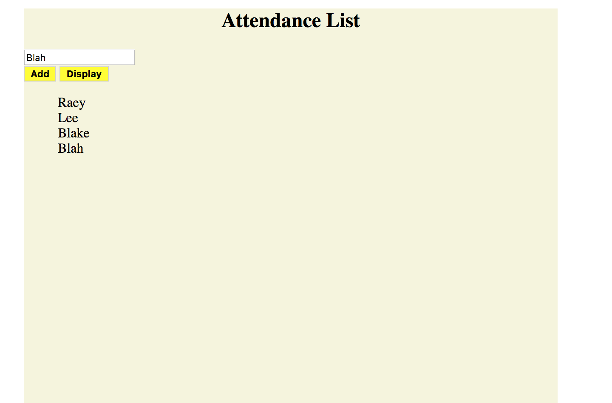

# STUDENT LIST PROJECT
This application allows teachers to take attendance as students walk into the classroom and display the list of names.

## How It's Made:

**Tech used:** HTML, CSS, JavaScript

## Optimizations
I would add a feature to display student's arrival time.

## Lessons Learned:

I learned how to utilize an (empty) array and have its input displayed in the dom.
