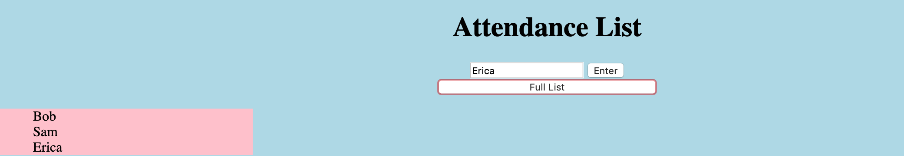

# My Awesome Project
For this project I made an attendance list app. The user is able to add things to the list and remove them.

## How It's Made:

I made this web application with both JavaScript, HTML, and CSS. The user can input names and enter them them. The user can then display the names typed in by clicking the "full list" button. I also, used css to add a blue background.

## Lessons Learned:

While making this web application I learned how to make an array and push new list items into an array.
