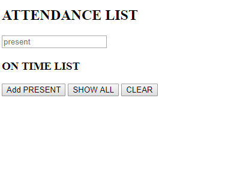

# 👩🏾‍🎓 Week05 Bootcamp2019a Project: Student List

### Goal: Build a Simple Student List App For A Teacher

Create a simple app where a teacher can enter student names as they arrive at class. The teacher should have the ability to press a button and see a list off all the students who have arrived.

## How It's Made:

**Tech used:** HTML, CSS, JavaScript, JQuery

## Lessons Learned:
Using a for loop to make sure the buttons are working properly. 

...
