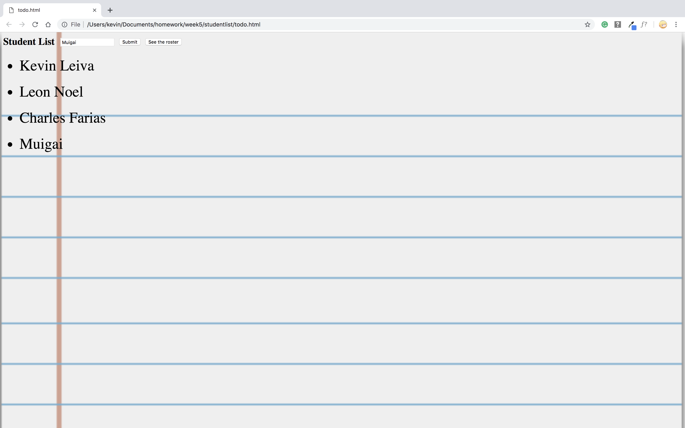

# Student List
This was a simple project made to display student names.

## How It's Made:

**Tech used:** HTML, CSS, JavaScript

I created the input for the user to type the student name. Made the button to submit the name and another button to display the roster. Then I move into JavaScript to make an array to store the students names, then create syntax in the html.

## Lessons Learned:

I learned that JavaScript can create items inside the html.
